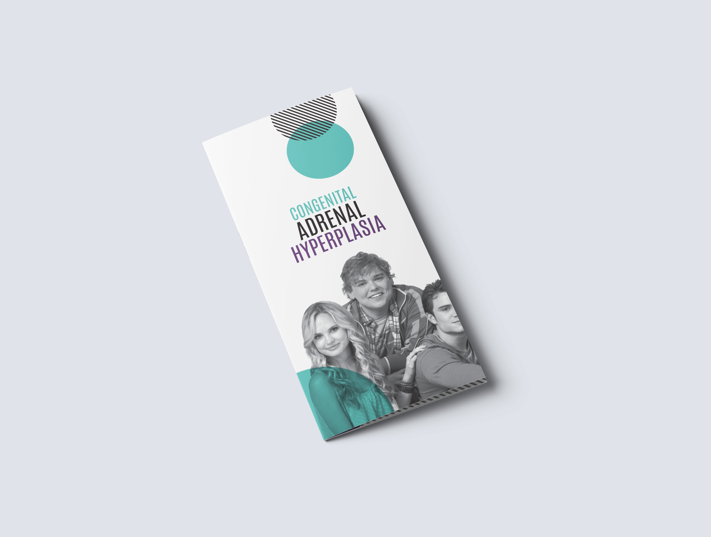
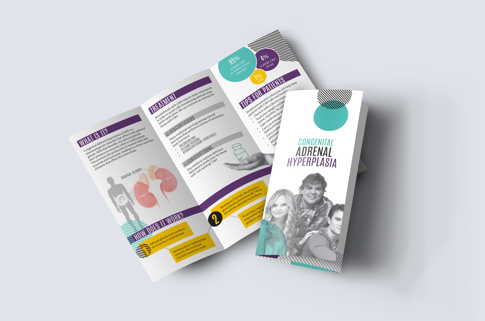
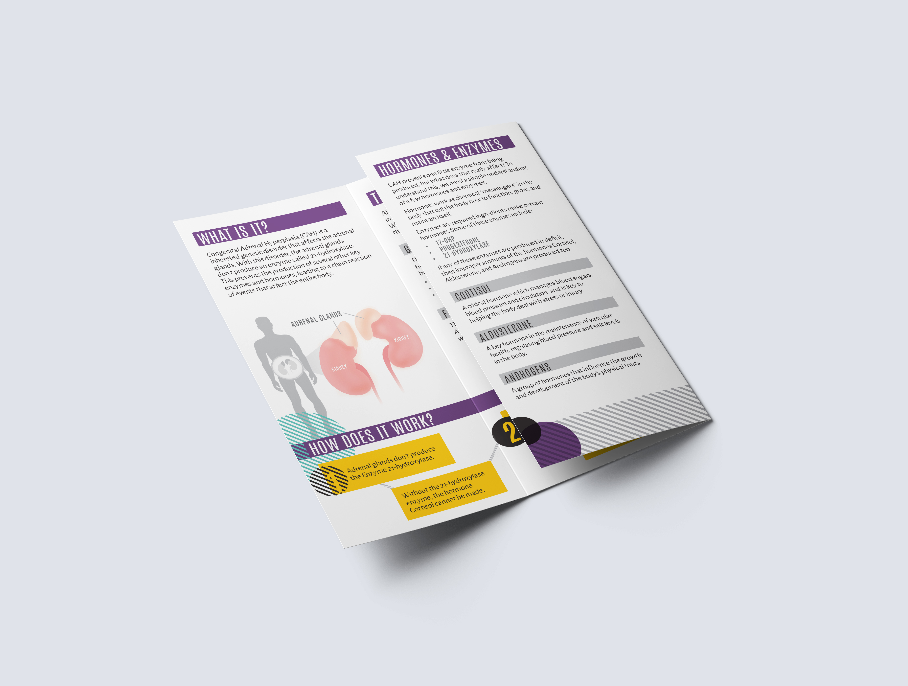
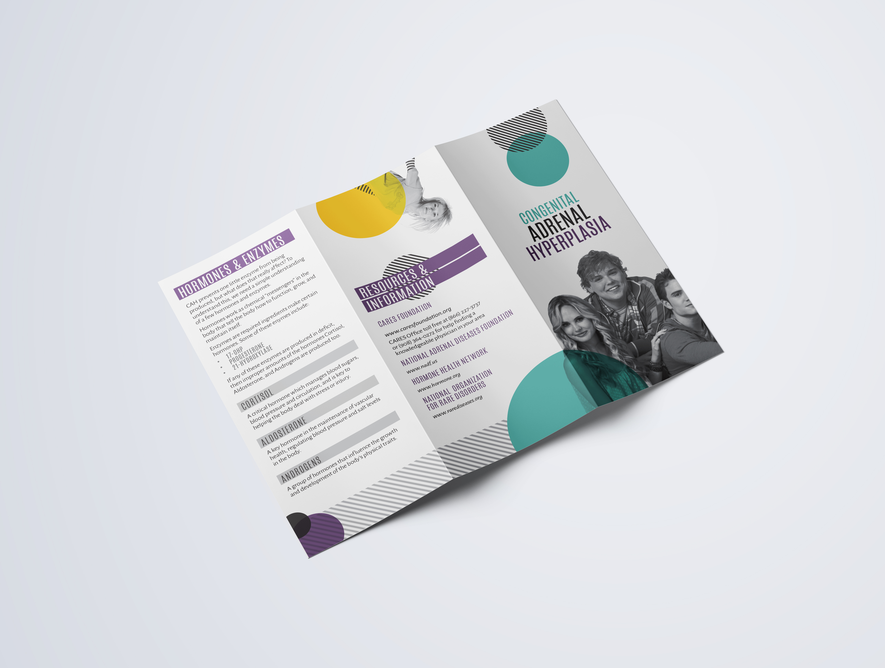
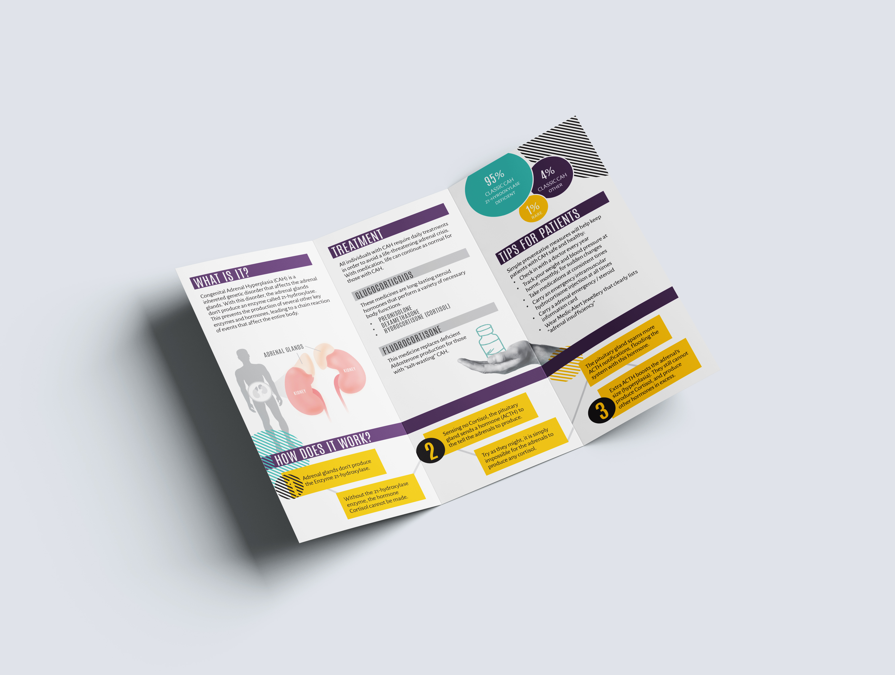

# CAH Brochure

Congenital Adrenal Hyperplasia is a rare disorder with many technical chemical components and a few key medical words. Because of this, I created this design to feel less intimidating and clinical, and more inviting to the reader. The ultimate goal was to simplify the key elements of the disorder to just a few words and steps in order to help doctors and patients easily explain the condition to others, and understand it themselves.

**Role** Graphic Designer, Copywriter
**For** Self-Promotion
**Type** Print Media

