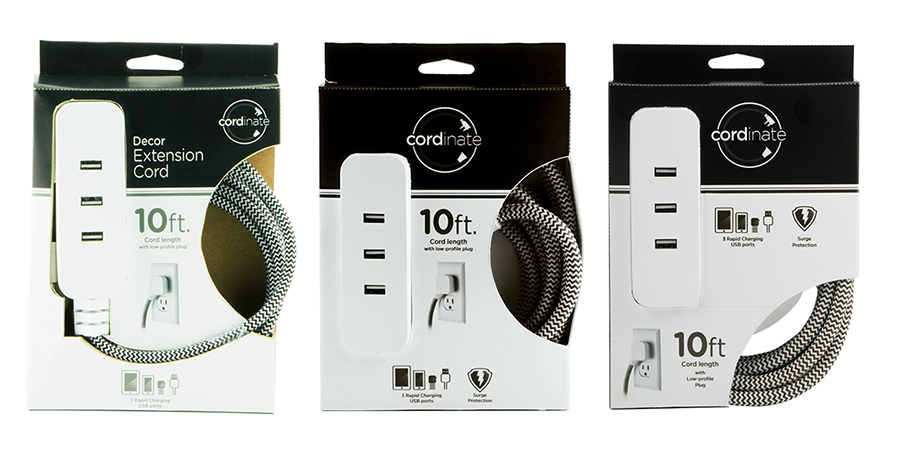
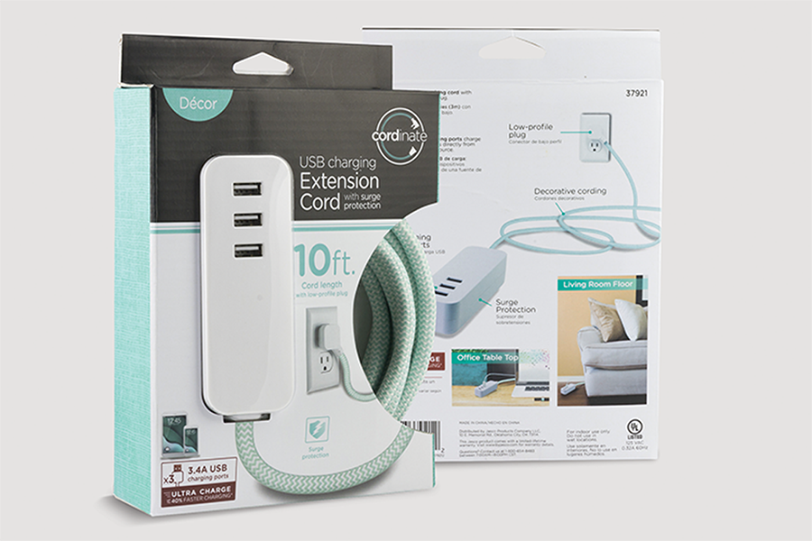
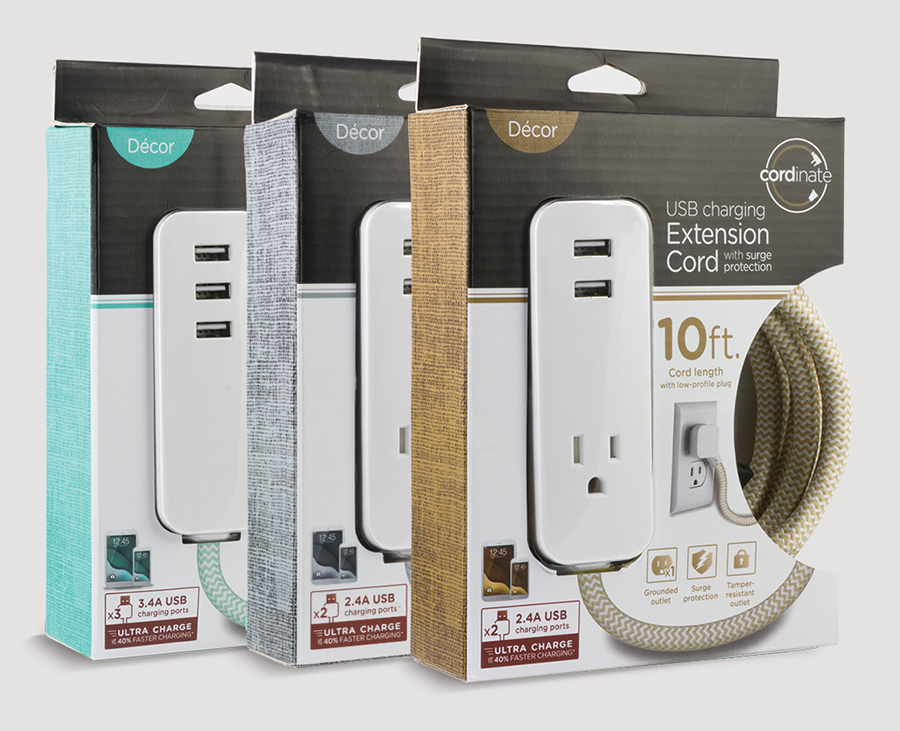
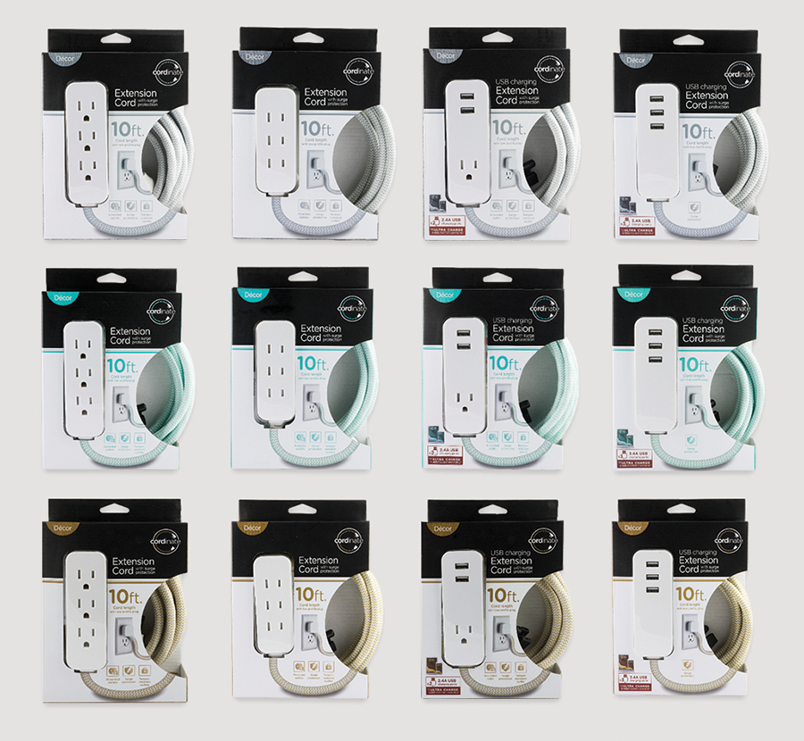

# Cordinate Extension Cords

Cordinate was a new house label under Jasco Products Company. The vision was for the customer to be able to interact and touch the most appealing part of the product. Through multiple hand cut samples, an open-side packaging was developed that not only encouraged customers to interact with the product, but kept the product secure as well. This goal was a success, as this product became one of the company’s top-five selling products in retail stores within the six months of production.

**Role** Graphic Designer, Package Designer  
**For** Jasco Products Company  
**Type** Retail Packaging  

  
  
  
  
