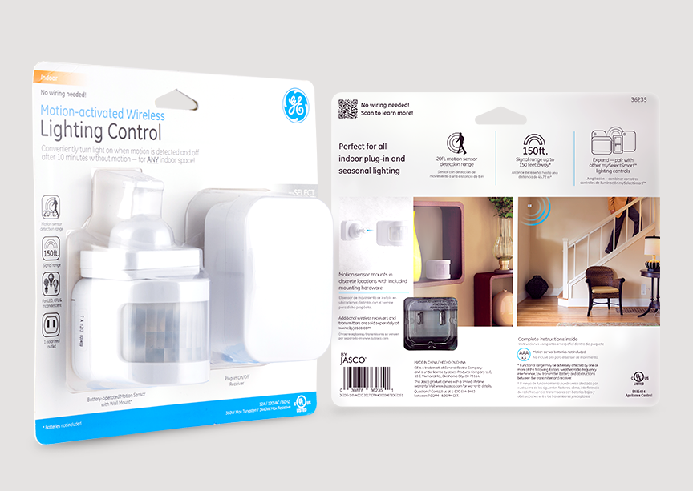
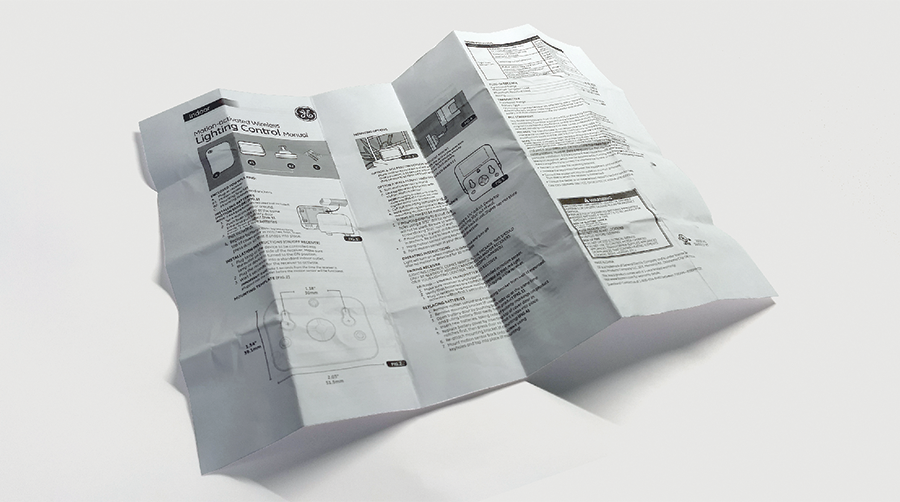
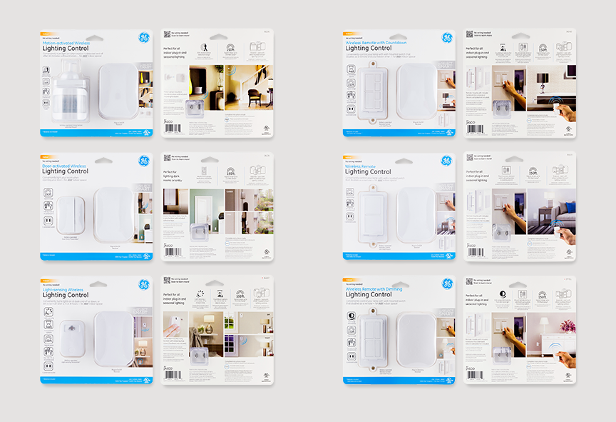

# GE Lighting Controls

A series of lighting controls under the GE-branded label. The line goal was to promote the simple-to-use nature of each product, and visually highlight simple consumer applications. Sole designer responsible for completion of all artworks, manuals, and illustrations on a tight two-month schedule amidst US holiday season, just prior to vendor’s Chinese New Year deadline.

**Role** Graphic Designer, Illustrator  
**For** Jasco Products Company  
**Type** Retail Packaging  

  
  
  
