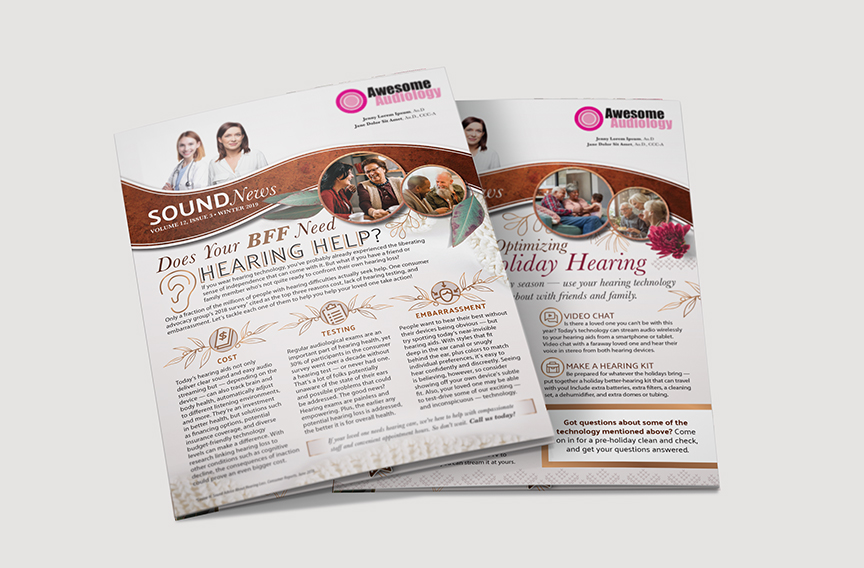
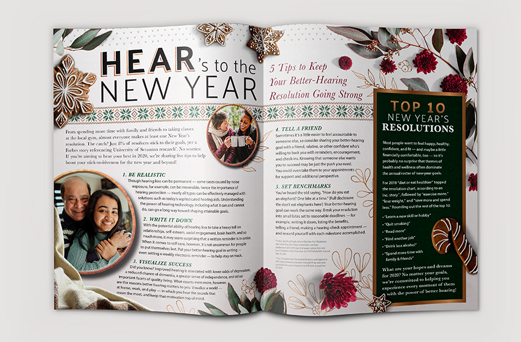
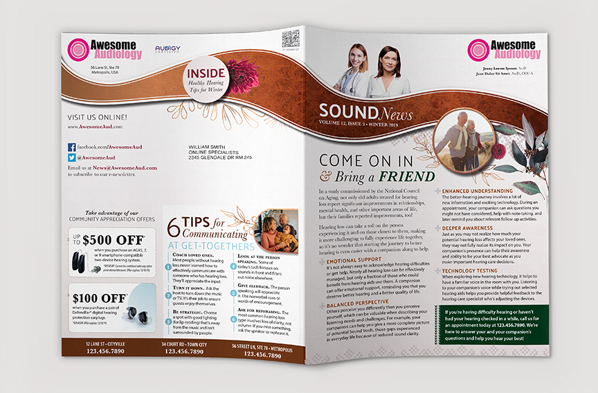
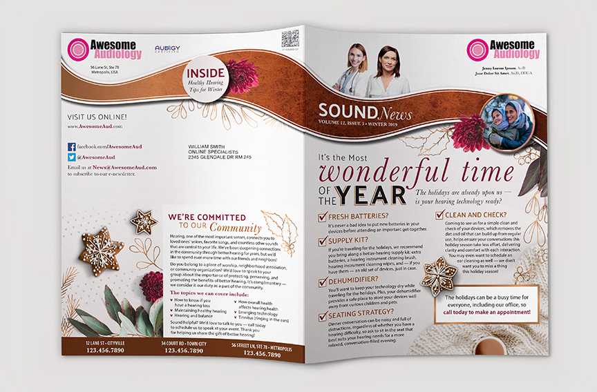
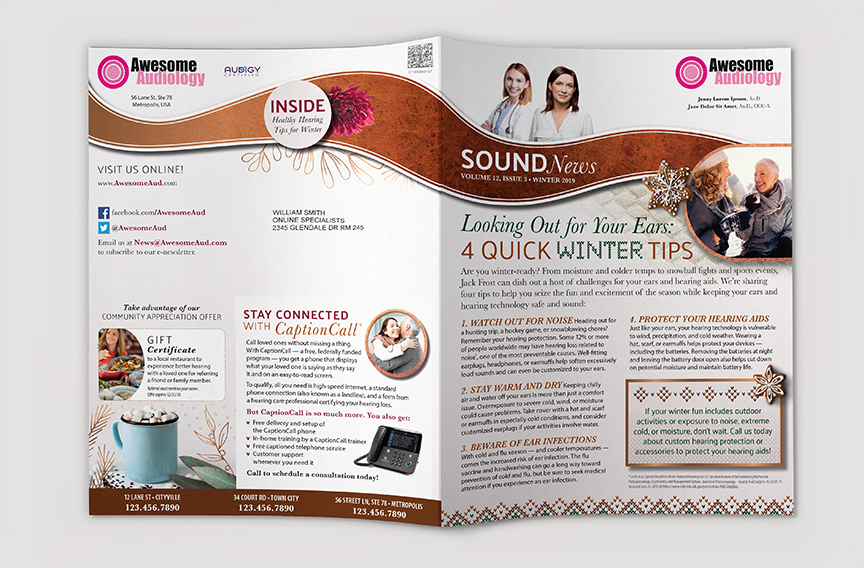

# Filling in the Blanks

Audigy’s Newsletter is printed mailing piece. The exterior spread is branded and customized for the client, but the interior spread is static to reduce printing costs.

**Role** Lead Graphic Designer
**For** Audigy
**Date** 2019
**Type** Direct Mail

<figure>
	
</figure>

<figure>
	
	<figcaption>Interior spread</figcaption>
</figure>

<figure>
	
	<figcaption>Exterior spread including front article, back article, and two coupons</figcaption>
</figure>

<figure>
	
	<figcaption>BExterior spread including front article, back article, and one coupon</figcaption>
</figure>

<figure>
	
	<figcaption>Exterior spread including front article, back article, and no coupons</figcaption>
</figure>
