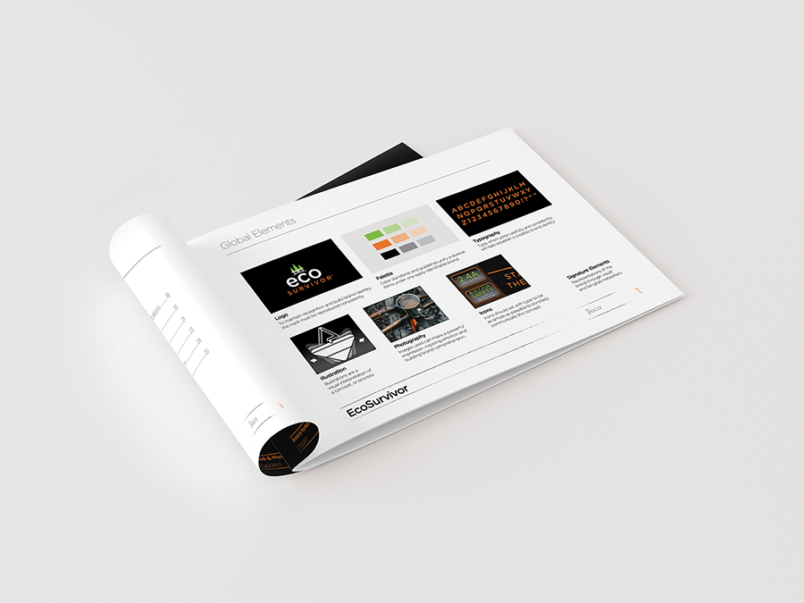
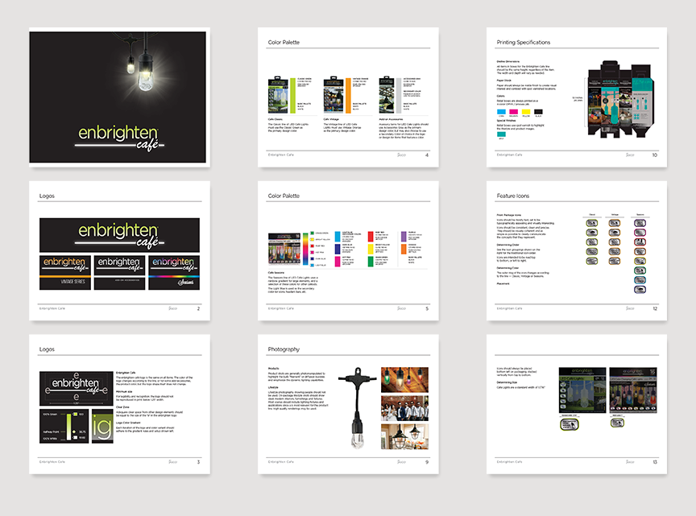
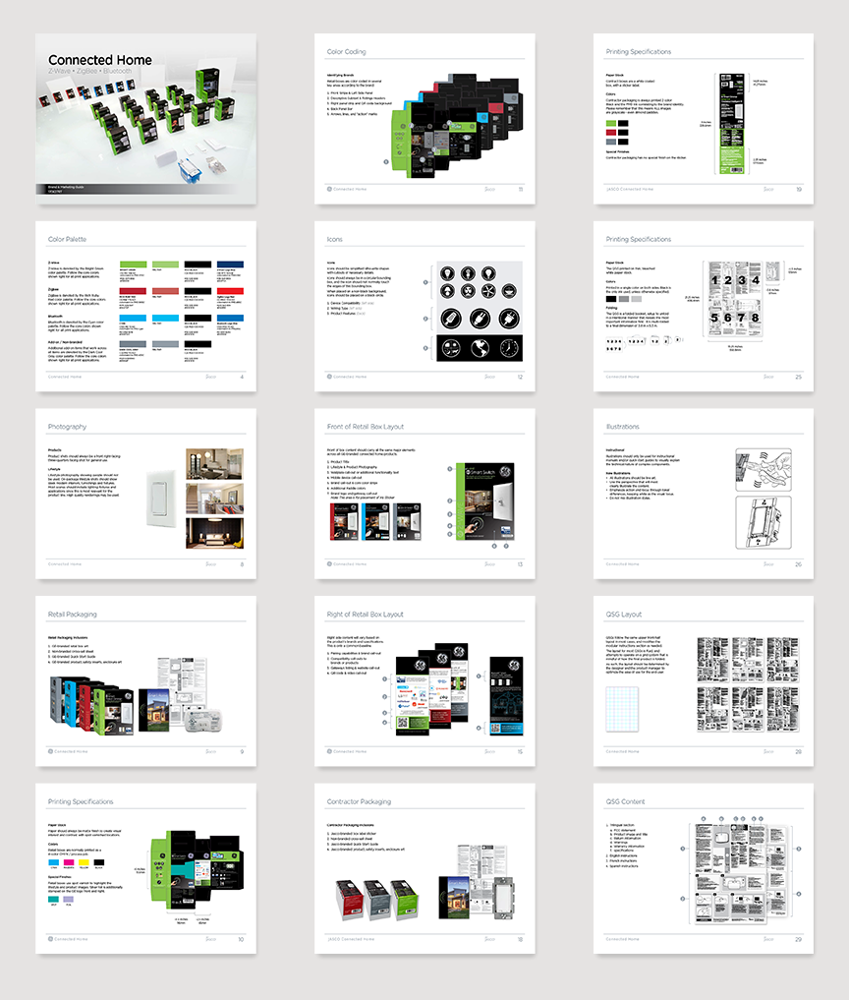
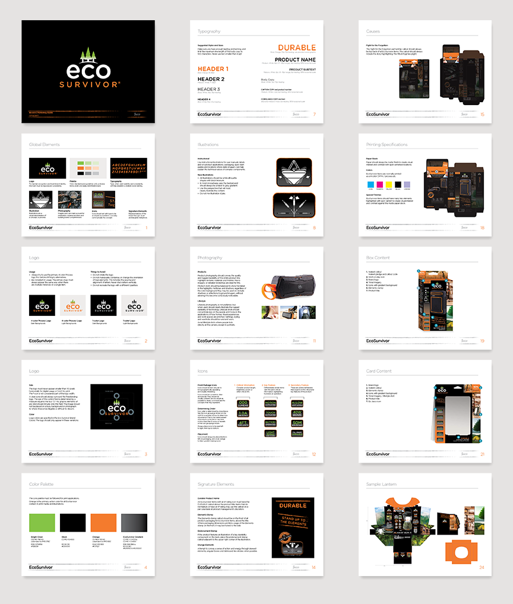
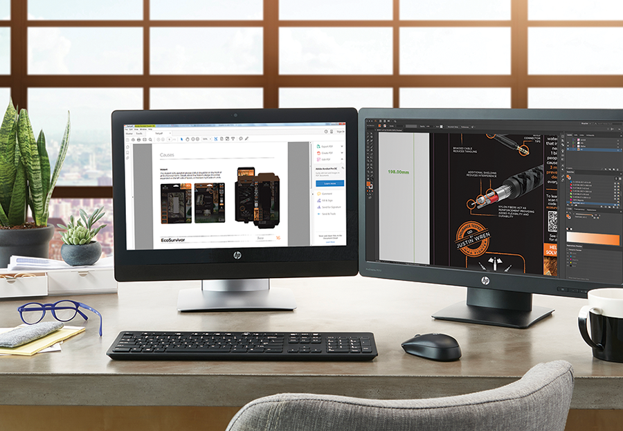

# Style Guides

These style guides were created for internal company use amongst the Jasco Products Company team of creatives, designers, and product developers. Most guidelines were created for existing lines that had existing artwork concepts, but no rules or guidelines for the creation of new art. The implementation of style guides for the Jasco team helped eliminate discrepancies between designers, and encouraged brand consistency with product developers.

**For** Jasco Products Company
**Type** Style guidelines

<figure>
	
	<figcaption>Most guides setup letter-size for simple printed reference by company members</figcaption>
</figure>

<figure>
	
	<figcaption>Enbrighten Cafe Lights</figcaption>
</figure>

<figure>
	
	<figcaption>Connected Home brands such as Z-Wave, ZigBee, and Bluetooth</figcaption>
</figure>

<figure>
	
	<figcaption>Eco Survivor</figcaption>
</figure>

<figure>
	
	<figcaption>Guides additionally created as interactive PDFs to ease reference and use in meeting and conferences</figcaption>
</figure>
